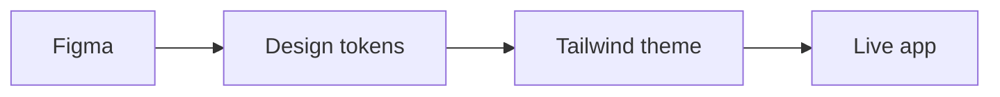

# Agency Delivery Dashboard Agent Guide

This repo is a Senior FED code sample. Preserve the story: a concise, conventional dashboard that demonstrates design-to-dev continuity from Figma, to tokens, to Tailwind, to the live app.



## References

- App: https://code-sample-three.vercel.app
- Storybook: https://code-sample-three.vercel.app/storybook
- Figma: https://www.figma.com/design/tIvu2Q2HhCLDTNmpnVr5FC/Code-Sample?node-id=16-3
- Source: https://github.com/mundizzle/code-sample

Vercel is GitHub-backed. Pushes to `main` deploy production.

## Guardrails

- Keep the app easy to inspect and explain in an interview.
- Do not add visible product UI copy about implementation, tooling, Figma, tokens, Storybook, Zustand, ECharts, or the fact that this is a code sample.
- Do not add backend/auth/persistence/product scope unless explicitly asked.
- Do not add an in-app theme switcher. Appearance follows `prefers-color-scheme`.
- Do not commit generated build, Storybook, framework, or local tool output.
- Prefer existing patterns, named exports, direct imports, colocated prop types, and small focused files.

## Principles

- Keep the root README human-facing. It should explain purpose, not become an implementation inventory.
- Keep implementation details discoverable in code, tests, and Storybook rather than over-explaining them in product UI.
- Prefer clear separation of concerns: server/data state, UI-only state, pure domain logic, chart configuration, and presentation should remain easy to trace.
- Keep browser-only behavior isolated behind small client boundaries.
- Keep chart option builders pure and tested. The rendering adapter owns browser-only lifecycle and resize behavior.
- Prefer semantic token-backed styling for colors and radii; use raw Tailwind for layout mechanics.
- Preserve responsive behavior, semantic HTML, keyboard-operable controls, useful chart labels, and document-level accessibility.

## Design Tokens

- Figma is the source of truth for design values. If a token changes, update both Figma and the repo token source, then regenerate the app theme.
- Keep token JSON internally consistent, including color `components` and `hex`.
- Treat app/Figma drift as a decision to resolve, not something to leave silently.
- Treat Lighthouse contrast failures as token or semantic-utility issues first. Keep `text-muted` legible on elevated surfaces.

## Tests And Storybook

- Use TDD for behavior changes when practical.
- Prefer behavior tests over snapshots.
- Add or update component-level Storybook stories for reusable components.
- Storybook is documentation and review surface; it does not replace tests.

## Validation

Run before handing off meaningful changes:

```bash
npm run test
npm run lint
npm run build
```

For visual or accessibility-sensitive changes, also run a local production smoke check or Lighthouse pass when practical.

## Agent Guidance

Before application code changes, check the relevant installed skill or current official docs for the framework, deployment, styling, responsiveness, or data-boundary area you are touching.

<!-- BEGIN:nextjs-agent-rules -->
# This is NOT the Next.js you know

This version has breaking changes — APIs, conventions, and file structure may all differ from your training data. Read the relevant guide in `node_modules/next/dist/docs/` before writing any code. Heed deprecation notices.
<!-- END:nextjs-agent-rules -->
