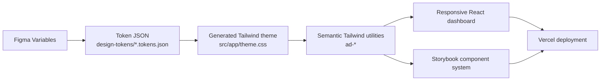

# Agency Delivery Dashboard Agent Guide

## What This Repo Demonstrates

This is a Senior FED code sample packaged as a modern UI architecture demo. The public README tells the human-facing story; this file tells agents how to preserve and extend that story without turning the repo into a grab bag.

The core demonstration is design-to-dev continuity:



The project should stay concise, conventional, and easy to explain in an interview. Prefer recognizable Next.js, React, Tailwind, Storybook, and Vercel patterns over clever custom infrastructure.

## Live References

- Source: https://github.com/mundizzle/code-sample
- App: https://code-sample-three.vercel.app
- Storybook: https://code-sample-three.vercel.app/storybook
- Figma: https://www.figma.com/design/tIvu2Q2HhCLDTNmpnVr5FC/Code-Sample?node-id=16-3

Vercel is GitHub-backed. Pushes to `main` deploy production.

## Primary Constraints

- Do not add visible product UI copy that explains the implementation, tooling, design tokens, Figma, Storybook, Zustand, ECharts, or that this is a code sample.
- Do not add an in-app theme switcher. Appearance follows `prefers-color-scheme`.
- Do not commit generated build output such as `public/storybook`, `.tmp-storybook-public`, `storybook-static`, `.next`, or local tool folders.
- Do not add a real backend, auth, persistence, or unrelated product scope unless the user explicitly asks.
- Keep changes small enough that the user can explain them in an interview.

## Project Map

- `README.md` - public project narrative and reviewer-facing workflow.
- `design-tokens/` - token JSON that represents exported Figma variables.
- `scripts/generate-tailwind-theme.mjs` - token JSON to `src/app/theme.css`.
- `scripts/build-storybook-public.mjs` - static Storybook build for `/storybook` on Vercel.
- `src/app/` - Next.js App Router shell, metadata, providers, and global CSS.
- `src/features/dashboard/types.ts` - dashboard domain model.
- `src/features/dashboard/data/` - deterministic fixtures and TanStack Query boundary.
- `src/features/dashboard/state/` - per-instance Zustand vanilla store and provider.
- `src/features/dashboard/utils/` - pure filtering, sorting, KPI, risk, and trend utilities.
- `src/features/dashboard/charts/` - ECharts palette hook and pure option builders.
- `src/features/dashboard/components/` - real dashboard components, tests, and component stories.
- `src/features/dashboard/foundations/` - Storybook design-token documentation.

## Architecture Rules

- Keep Server Components as the default in `src/app`.
- Push `"use client"` down to the smallest component that needs browser APIs, hooks, or events.
- Keep `DashboardView` as the composition layer:
  - query dashboard data,
  - read/write dashboard UI state,
  - build chart options,
  - compose sections.
- Keep presentational UI in focused component files.
- Use named exports.
- Keep prop types colocated with components. Export them only when another component or Storybook needs them.
- Avoid barrel files in this feature; direct imports keep the code sample easy to trace.
- Keep TanStack Query responsible for data/server-state boundaries.
- Keep Zustand responsible for UI-only state.
- Copy caller-owned arrays and objects before storing them in Zustand.
- Keep chart option builders pure and tested. `EChart` owns browser-only lifecycle and resize behavior.

## Styling Rules

- Prefer semantic `ad-*` Tailwind utilities from generated tokens:
  - `bg-ad-bg`
  - `bg-ad-surface`
  - `bg-ad-surface-elevated`
  - `text-ad-text`
  - `text-ad-text-muted`
  - `border-ad-border`
  - `bg-ad-accent`
  - `rounded-ad-sm`, `rounded-ad-md`, `rounded-ad-lg`
- Use raw Tailwind values for layout mechanics, grid tracks, responsive breakpoints, sizing, and one-off values not represented by tokens.
- Preserve mobile-first responsive behavior.
- Preserve the `ProjectDetailPanel` container-query example.
- Use semantic HTML and accessible controls: headings, landmarks, buttons, `aria-pressed` for toggle chips, useful `aria-label` values for charts, and keyboard-operable interactions.
- If app and Figma drift, intentionally choose which artifact should move, then align the other. Do not silently let them diverge.

## Storybook Rules

- Every reusable dashboard component should have a component-level story under `Dashboard/Components/...`.
- Keep the full dashboard story as a composed reference, not as the only documentation surface.
- Expose controls where props are meaningful: labels, values, deltas, statuses, selected project, empty states, and option-like component states.
- Use the installed design-token Storybook addon for token docs. Do not hand-roll custom token boards.
- `npm run build` builds static Storybook into `public/storybook` through `prebuild`; keep that output ignored.

## Testing Rules

- Use TDD for behavior changes when practical.
- Prefer behavior tests over snapshots.
- Keep pure utility tests focused and readable.
- Cover important UI behavior with React Testing Library:
  - dashboard content renders,
  - implementation commentary stays out of the product UI,
  - client filters work,
  - selected project details update,
  - responsive class expectations remain intentional,
  - the container-query example remains present.
- Storybook is documentation and review surface; it does not replace tests.

## Common Change Recipes

### Change a design token

1. Update the relevant token file in `design-tokens/`.
2. Run `npm run generate-tailwind-theme`.
3. Use generated semantic utilities in app or Storybook code.
4. Run validation.

### Add or change a dashboard component

1. Add or update the focused component file in `src/features/dashboard/components/`.
2. Add or update behavior tests if behavior changes.
3. Add or update a component-level Storybook story.
4. Compose it from `DashboardView` only after the component is independently understandable.

### Add chart behavior

1. Add or update pure option-builder logic in `src/features/dashboard/charts/`.
2. Test the option builder.
3. Wire the option into `EChart` from a client component.

### Prepare to ship

1. Run `npm run test`.
2. Run `npm run lint`.
3. Run `npm run build`.
4. Check that generated artifacts remain uncommitted.
5. Push `main`.
6. Verify both the app and `/storybook` after Vercel deploys.

## Commands

```bash
npm run dev
npm run storybook
npm run generate-tailwind-theme
npm run test
npm run lint
npm run build
npm run build-storybook
npm run build-storybook:public
```

## Required Agent Guidance

Before application code changes, use the relevant installed skills or official docs:

- `vercel:nextjs` for App Router, Server/Client Component, and Vercel conventions.
- `vercel:react-best-practices` after editing multiple TSX files.
- `vercel:vercel-cli` before deployment, logs, linking, or Vercel project settings.
- `responsive-design` before responsive layout work.
- `tailwind-design-system` before token or Tailwind system work.
- `tanstack-query-best-practices` before query/data-boundary changes.

If a skill is unavailable, use `find-skills` or inspect official docs before proceeding.

<!-- BEGIN:nextjs-agent-rules -->
# This is NOT the Next.js you know

This version has breaking changes — APIs, conventions, and file structure may all differ from your training data. Read the relevant guide in `node_modules/next/dist/docs/` before writing any code. Heed deprecation notices.
<!-- END:nextjs-agent-rules -->
