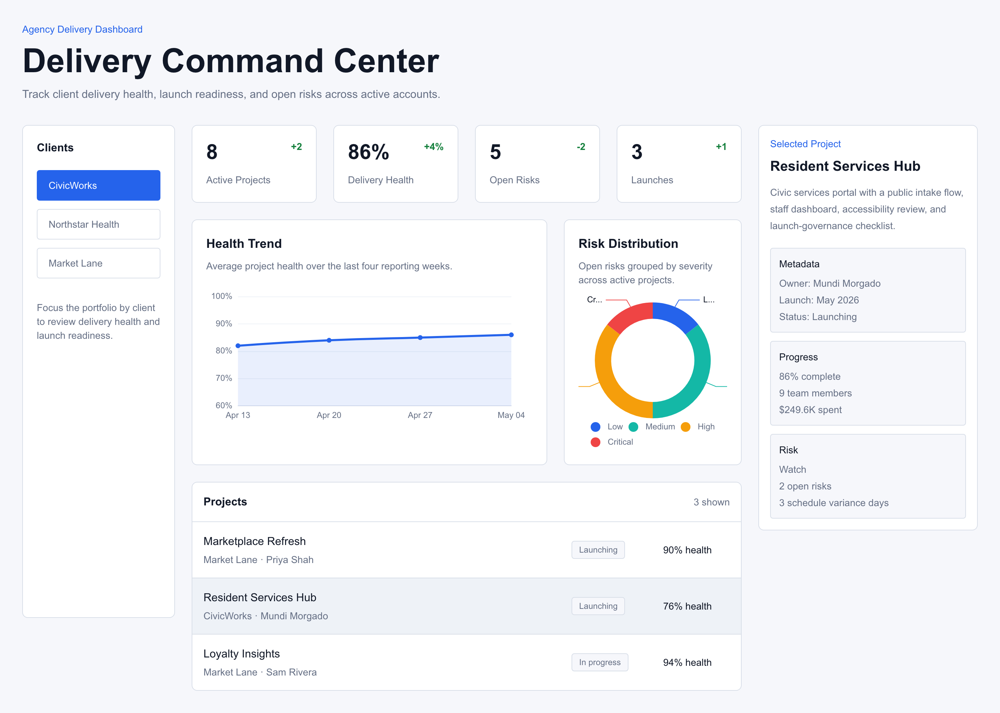
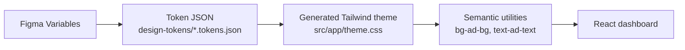
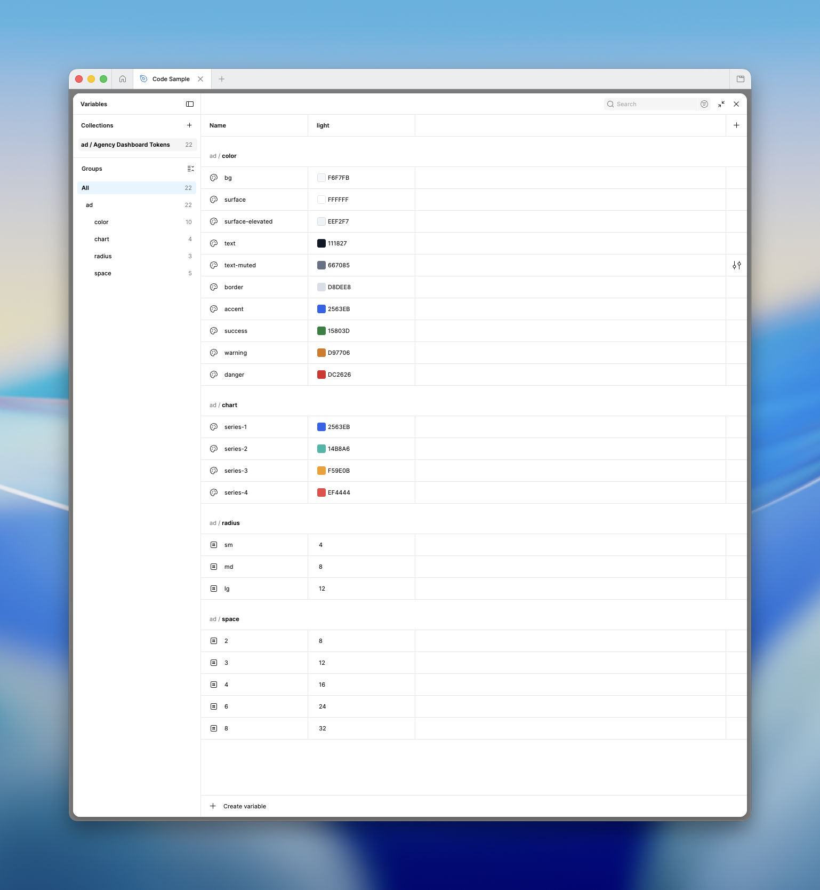
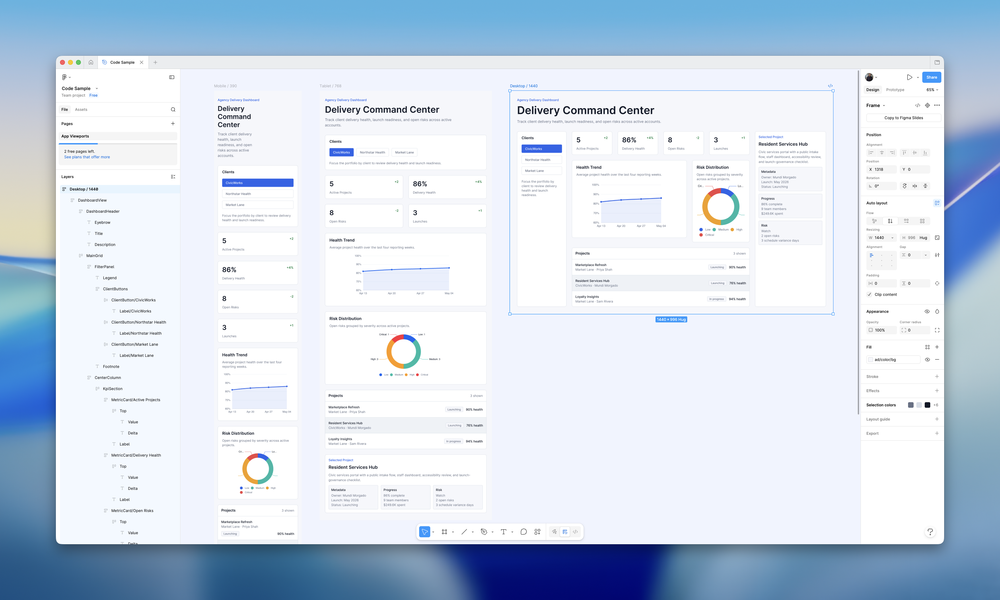
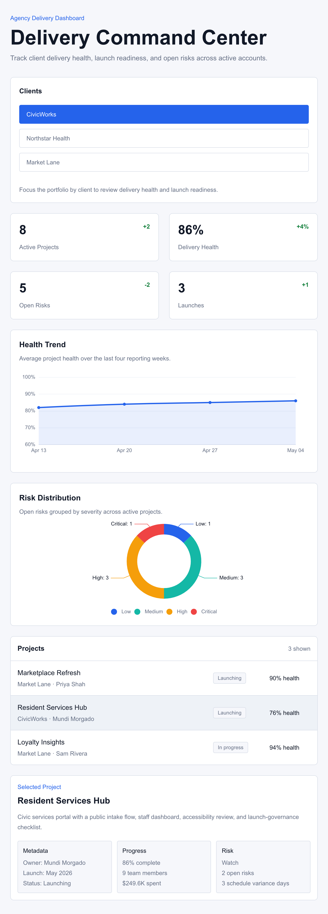
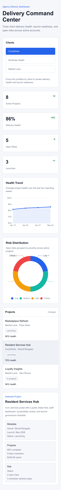
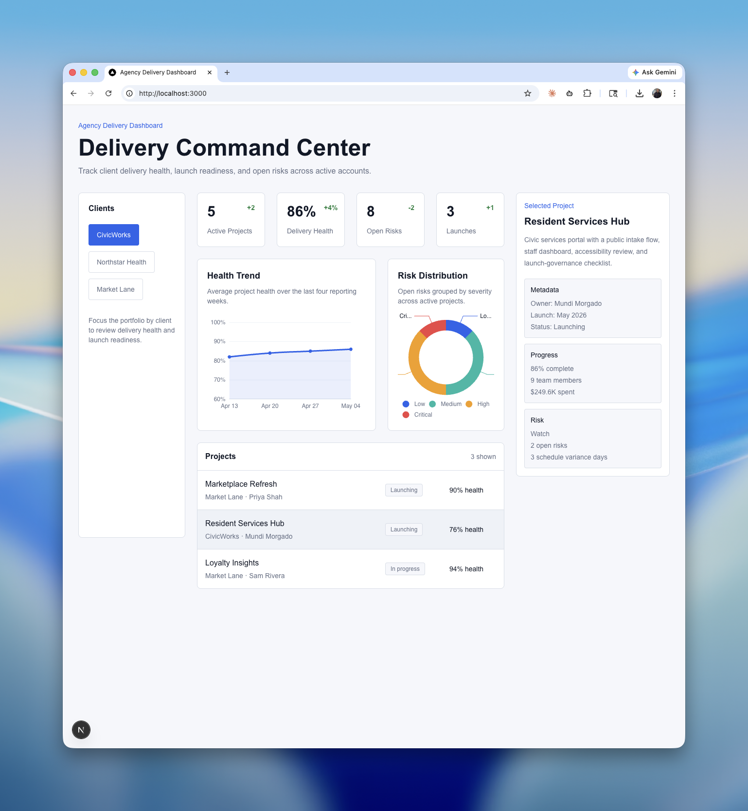
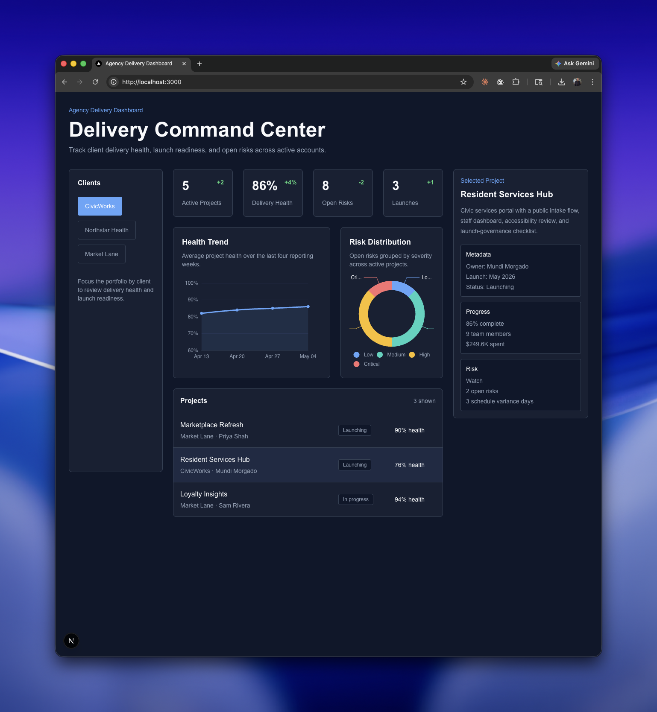
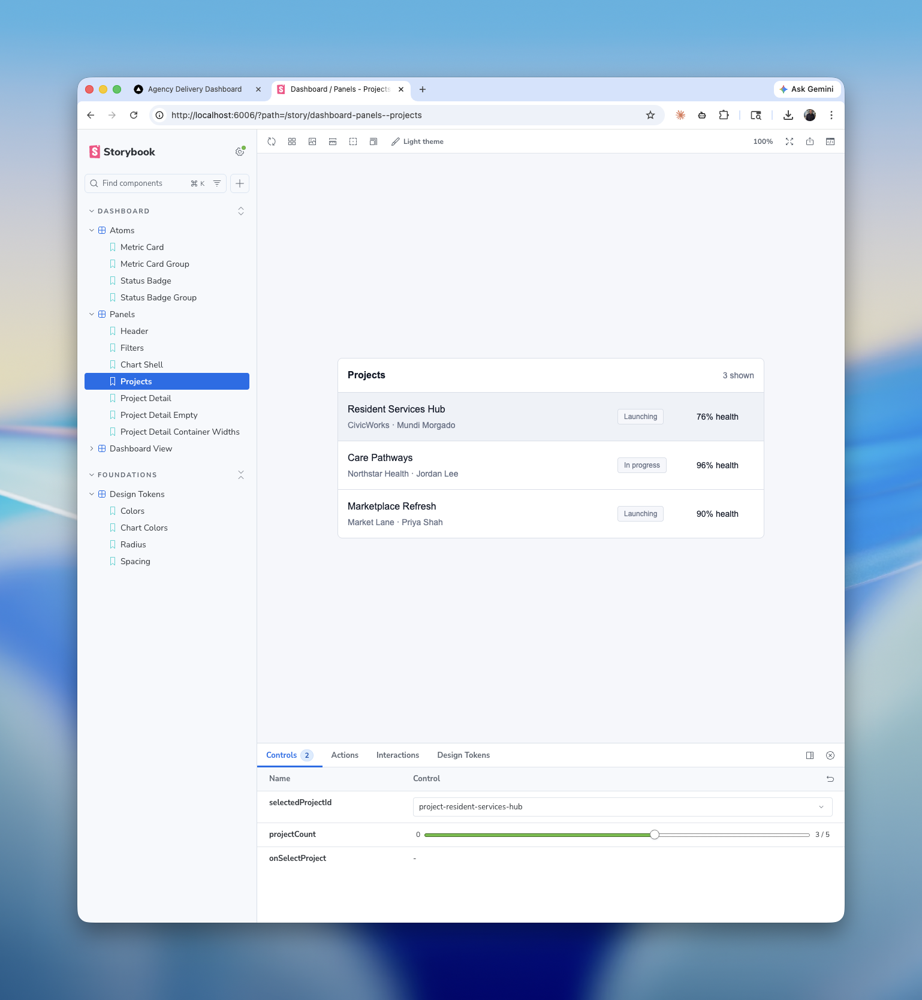
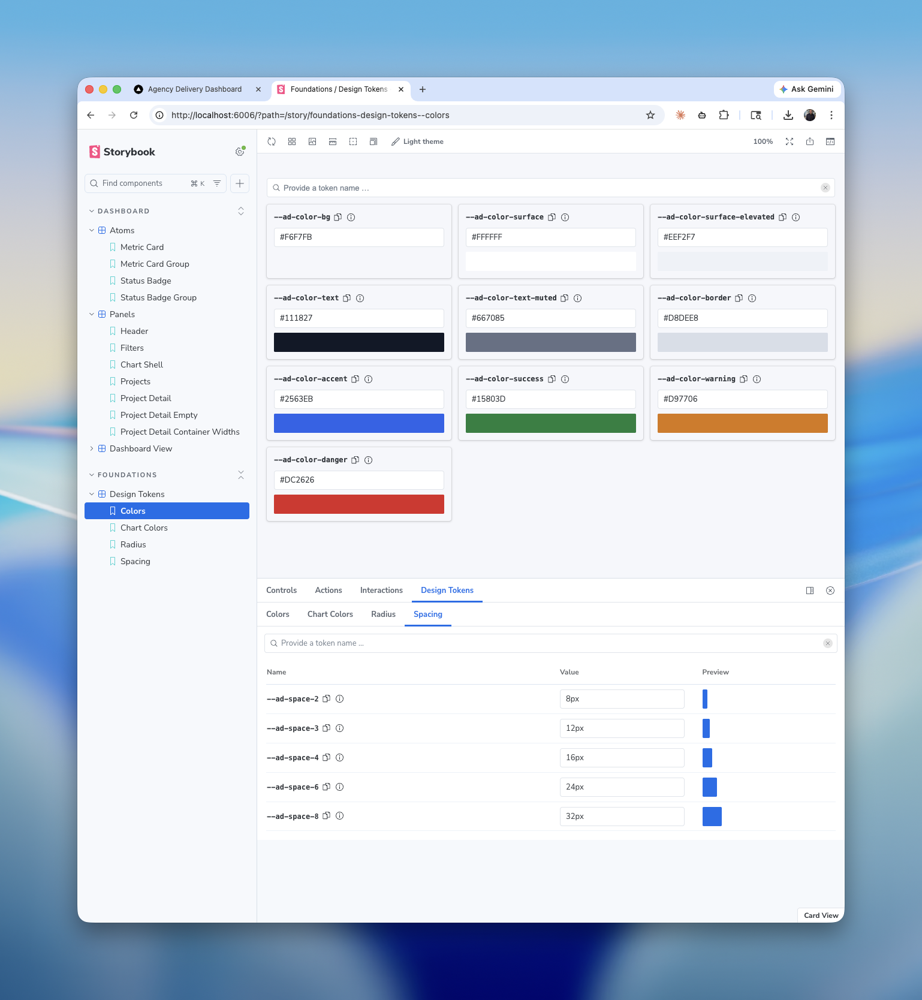

# Modern UI Architecture Demo: Agency Delivery Dashboard

This is a fully coded reference implementation for how I think a modern front-end workflow should fit together. It distills the parts of front-end development that I have had the most success with on real projects: a conventional framework and deployment foundation, design tokens wired into code, responsive UI, a design-system surface, charting, clear state boundaries, and focused tests.

The main idea is reducing drift while still using tools that can handle real application complexity. Design values, component documentation, application code, and the deployed UI should stay connected instead of being manually copied across tools until they slowly fall out of sync. At the same time, the architecture needs to hold up for heavy UI state, interactive data, and product surfaces that behave more like applications than static websites.

## Key Pieces

- [Source code](https://github.com/mundizzle/code-sample)
- [Visual design](https://www.figma.com/design/tIvu2Q2HhCLDTNmpnVr5FC/Code-Sample?node-id=16-3)
- [Design system](https://code-sample-three.vercel.app/storybook)
- [Live application](https://code-sample-three.vercel.app)

Desktop screenshot:



## Platform and Workflow

The project follows a familiar modern front-end workflow from source control through production deployment. I intentionally leaned on common, battle-tested tools here. Popularity matters in front-end work, for better or worse: widely used tools have more people finding bugs, fixing bugs, writing docs, answering questions, and publishing examples when something breaks.

- **[GitHub](https://github.com/)** keeps the source, docs, and review history in one place.
- **[Vercel](https://vercel.com/)** keeps deployment close to the repo, so the live app reflects the main branch.
- **[Next.js App Router](https://nextjs.org/docs/app)** gives the app a standard routing, rendering, and deployment model.
- **[React 19](https://react.dev/)** and **[TypeScript](https://www.typescriptlang.org/)** keep the UI component-based while making contracts explicit. TypeScript is doing real work here: it catches whole categories of mistakes and makes refactors safer.
- **[Tailwind CSS v4](https://tailwindcss.com/)** connects generated design tokens to the UI without a custom styling layer.
- **[TanStack Query](https://tanstack.com/query/latest)** and **[Zustand](https://zustand.docs.pmnd.rs/)** keep server/data state separate from local UI state.
- **[ESLint](https://eslint.org/)**, **[Vitest](https://vitest.dev/)**, and **[React Testing Library](https://testing-library.com/docs/react-testing-library/intro/)** catch regressions at the code, logic, and interaction levels.
- **[Storybook](https://storybook.js.org/)** gives the components and tokens a design-system surface outside the main app.

## Design-To-Dev Workflow

[Figma Variables](https://help.figma.com/hc/en-us/articles/15339657135383-Guide-to-variables-in-Figma) are the design source of truth. The repo carries Figma-style token exports, generates a Tailwind theme bridge, and consumes those values through semantic utilities in the React dashboard. This is the part of the workflow that solves one of the most common handoff problems: no more copying values from Figma into code by hand and hoping every place stays current.



Figma variable source:



The token contract stays stable across design and code, which makes the handoff easier to reason about:

| Layer | Example |
| --- | --- |
| Figma variable | `ad/color/bg` |
| CSS custom property | `--ad-color-bg` |
| Tailwind utility | `bg-ad-bg` |

Component styles use semantic Tailwind utilities generated from token names instead of raw values like `#2563EB`. That keeps the UI using values from the design system instead of random primitives, and it makes the code read in product terms like background, surface, accent, border, and text:

```tsx
<section className="bg-ad-bg text-ad-text border-ad-border">
  <button className="bg-ad-accent text-ad-surface">Review</button>
</section>
```

The main files in that path are:

| File | Purpose |
| --- | --- |
| `design-tokens/light.tokens.json` | Light appearance token export |
| `design-tokens/dark.tokens.json` | Dark appearance token export |
| `scripts/generate-tailwind-theme.mjs` | Converts token exports into Tailwind CSS variables |
| `src/app/theme.css` | Generated theme variables consumed by Tailwind |
| `src/app/globals.css` | Tailwind entry point for the Next.js app |

When a designer changes a variable in Figma, the implementation path stays small: export the updated token JSON, replace the matching file in `design-tokens/`, run `npm run generate-tailwind-theme`, and let the React UI update through the existing semantic utilities. Update the token once, then let the system carry it through.

## Figma-Aligned Application UI

The Figma `App Viewports` reference and the browser implementation are aligned around the current application. That gives reviewers a practical comparison point: the design file, the component system, and the deployed app are meant to stay in sync, not become separate artifacts that drift over time.

Figma app viewport reference:



## Responsive Tailwind UI

The dashboard is mobile-first and responsive across the practical viewport range. Tailwind handles the page-level layout shifts, while `ProjectDetailPanel` includes a component-level container query so the panel can respond to its own available space. Responsiveness stays local where the component needs it, instead of pushing every decision up to the page layout.

Tablet layout:



Mobile layout:



## Token-Driven Appearance

Light and dark appearance are both token-backed. The app responds to `prefers-color-scheme`, so Tailwind utilities point at CSS variables and the browser updates those variables when the operating system appearance changes. The semantic Tailwind layer gives light and dark mode support without scattering conditional theme logic through the React tree.

Light mode:



Dark mode:



Brand is separate from appearance. A fuller white-label system could add brand-specific token sets, for example `default.light.tokens.json`, `default.dark.tokens.json`, `brand.light.tokens.json`, and `brand.dark.tokens.json`. This demo keeps one brand and focuses on the design-to-dev handoff plus OS-driven light/dark support.

## Application Architecture

The application keeps the major boundaries easy to follow. Each kind of complexity has a clear home, which matters once the UI has real data, filters, charts, selected records, and user-driven state changes.

**Application shell**

- **Server Components** remain the default in the **Next.js App Router**.
- **Client providers** are isolated under `src/app/providers.tsx`.

**State boundaries**

- **TanStack Query** owns the fixture-backed dashboard data boundary.
- **Zustand** owns UI-only state such as selected client, selected project, filters, date range, chart mode, and mobile panel state.

I like this pairing because it keeps two very different kinds of state from getting tangled. TanStack Query is good at data loading, caching, and refresh behavior. Zustand is good at the local state that drives interaction, filtering, sorting, chart modes, and selected UI panels. That split mattered a lot on Wilson QBX, where the UI had to track thousands of football throws, plot them on charts, and still support interactive filtering and sorting.

**Testable logic**

- **Dashboard utilities**, **state transitions**, and **[ECharts](https://echarts.apache.org/) option builders** are covered by focused tests.
- **ECharts rendering** is isolated behind a browser-only wrapper, while option builders stay pure and testable.

I used ECharts because it has held up well for me on data-heavy projects, including [Wilson QBX](https://qbx.wilson.com/) and [Peak Performance Project (P3)](https://app.p3.md). QBX was a Bluetooth-connected football launch now used by NFL, Division I college, and elite high-school programs. P3 was an athlete biomechanics platform used by professional athletes and in the NBA Pro Basketball Combine. ECharts handled large volumes of data while still allowing detailed visual customization. Keeping the option builders pure also makes the chart behavior much easier to test.

That gives the demo the state-management shape of a larger production dashboard: server/data state, client UI state, pure domain utilities, and browser-only visualization concerns each have a clear place.

## Component System

Storybook is the design-system surface for this demo. I have found it especially useful with clients because it makes the component breakdown visible outside the main app. It also makes it easier to prototype and assemble new pages from existing pieces instead of starting from a blank screen every time.

Component documentation:



Token documentation:



## Working With The Repo

The sections above explain what this demo is trying to show. This part is the practical repo workflow.

### Install

Install dependencies:

```bash
npm install
```

### Run the app

Start the local dev server:

```bash
npm run dev
```

Open http://localhost:3000 to view the app.

### Regenerate tokens

Regenerate the Tailwind theme bridge from the token files:

```bash
npm run generate-tailwind-theme
```

### Run the design system

Run Storybook locally:

```bash
npm run storybook
```

### Validate and build

```bash
npm run test
npm run lint
npm run build
```

`npm run build` also regenerates the token theme and builds static Storybook into `public/storybook` before running `next build`.

### Deployment

Vercel is connected to the GitHub repo. Pushes to `main` trigger production deployments, and the static Storybook build ships with the app as the deployed [design system](https://code-sample-three.vercel.app/storybook).
