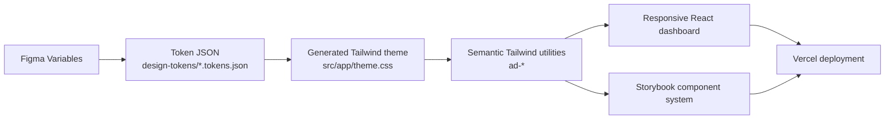

# Agency Delivery Dashboard

This is a coded reference implementation for how I think a modern front-end workflow should fit together: conventional framework choices, design tokens wired into code, responsive UI, Storybook documentation, clear state boundaries, charting, and focused tests.

The goal is not to show every possible feature. It is to show a front-end architecture that is easy to inspect, easy to explain, and realistic enough to hold up under application-style complexity.

## Key Links

- [Live application](https://code-sample-three.vercel.app)
- [Storybook design system](https://code-sample-three.vercel.app/storybook?path=/story/views-dashboard--default)
- [Figma reference](https://www.figma.com/design/tIvu2Q2HhCLDTNmpnVr5FC/Code-Sample?node-id=16-3)
- [Source code](https://github.com/mundizzle/code-sample)


## Workflow Overview

The through-line is design-to-dev continuity. Figma-style tokens are committed as JSON, generated into Tailwind-ready CSS variables, consumed by the React dashboard, documented in Storybook, and shipped through the same Vercel deployment path.



The subfolder READMEs explain the pieces in more detail. The root README is meant to give the quick mental model first: one connected workflow from design source, to implementation, to review surface, to deployment.

## What To Look For

- Design tokens move from Figma-style JSON exports into Tailwind CSS variables.
- Storybook gives the dashboard components and token system a review surface outside the app.
- TanStack Query owns fixture-backed server state, while Zustand owns UI-only state.
- ECharts is isolated behind a small adapter, with chart option builders kept pure and tested.
- The app is responsive, token-backed, and deployed through the same repo flow reviewers can inspect.

## Project Map

| Area | What to inspect |
| --- | --- |
| [`design-tokens/`](design-tokens/README.md) | Figma-style token exports for light and dark appearance. |
| [`scripts/`](scripts/README.md) | Build helpers for token generation and deployed Storybook. |
| [`.storybook/`](.storybook/README.md) | Storybook configuration, theme preview, MSW mocks, and navigation. |
| [`src/app/`](src/app/README.md) | Next.js App Router shell, providers, generated theme CSS, and dashboard API route. |
| [`src/components/`](src/components/README.md) | Visible dashboard components, chart components, and component stories. |
| [`src/data/`](src/data/README.md) | TanStack Query boundary and Storybook mock service worker handlers. |
| [`src/design-system/`](src/design-system/README.md) | Token documentation rendered inside Storybook. |
| [`src/lib/`](src/lib/README.md) | Internal adapters, currently the ECharts bridge. |
| [`src/model/`](src/model/README.md) | Domain types, labels, formatters, and pure dashboard logic. |
| [`src/state/`](src/state/README.md) | Zustand store for local dashboard UI state. |
| [`src/test/`](src/test/README.md) | Vitest and React Testing Library setup. |

## Prerequisites

- Node.js 20 or newer
- npm

## Install

```bash
npm install
```

## Run The App

```bash
npm run dev
```

Open http://localhost:3000.

## Run Storybook

```bash
npm run storybook
```

Open http://localhost:6006.

## Regenerate Tokens

```bash
npm run generate-tailwind-theme
```

This reads `design-tokens/*.tokens.json` and rewrites `src/app/theme.css`.

## Validate And Build

```bash
npm run test
npm run lint
npm run build
```

`npm run build` also regenerates the Tailwind theme bridge and builds static Storybook into `public/storybook` before running `next build`.

## Deployment

Vercel is connected to the GitHub repo. Pushes to `main` deploy the app, and the static Storybook build ships with it at `/storybook`.
