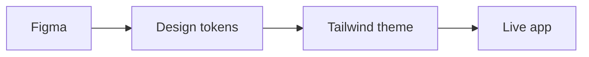

# About this project

This is a reference implementation for how I approach a modern front-end workflow and delivery in a consulting context. It uses conventional framework choices, a shared language across design and development, and documentation generated from code. The goal is to deliver something that is easy to comprehend and build upon.

## Key Components

- Source: https://github.com/mundizzle/code-sample
- Design: https://www.figma.com/design/tIvu2Q2HhCLDTNmpnVr5FC/Code-Sample
- Design System: https://code-sample-three.vercel.app/storybook
- Live App: https://code-sample-three.vercel.app

## Built Using

- Next.js: React application framework
- Tailwind CSS: Styling and theming
- Storybook: Design system generator
- ECharts: Data visualization
- TanStack Query: Fetching, caching, and updating API data
- Zustand: Client state management


*Application screenshot*

## Process Overview

What a demo like this cannot simulate is the upfront planning required to align stakeholders across client, product, design, and dev. In my experience, that's one of the biggest keys to success for any project.

That said, I try to carry that same idea into the design-to-dev workflow, where the output is actually created. The through-line is driven by design tokens: a shared language that can be used natively by designers, developers, design tools, and code.

In this example, Figma holds the source of truth for the design values expressed in tokens. The exported token JSON is checked in under `design-tokens/`, then translated into generated CSS for the app theme and Storybook token docs. Updates to design in Figma cascade through to live code by re-exporting and regenerating the theme. Even that process can be automated for a real project.



---

## Local setup instructions

### Prerequisites

- Node.js 20 or newer
- npm

### Install

```bash
npm install
```

### Restore Agent Skills

This repo locks project-local skills for future code review and implementation work in `skills-lock.json`. Restore the local skill files after installing dependencies:

```bash
npm run skills:install
```

The restored skills are written to `.agents/skills`, which is ignored by git. They cover Next.js App Router practices, Vercel React performance guidance, component composition patterns, and accessible component building. Restart Codex or start a fresh agent session after restoring them.

### Run the App

```bash
npm run dev
```

Open http://localhost:3000.

### Run Storybook

```bash
npm run storybook
```

Open http://localhost:6006.

### Regenerate Tokens

```bash
npm run generate-tailwind-theme
```

This reads the checked-in Figma token exports in `design-tokens/*.tokens.json` and rewrites ignored generated CSS files used by the app and Storybook:

- `src/app/theme.css`
- `src/design-system/design-tokens.tokens.css`

The same generation step runs automatically before `dev`, `test`, `test:watch`, `storybook`, `build-storybook`, `build-storybook:public`, and `build`.

## Validate and Build

```bash
npm run test
npm run lint
npm run build
```

`npm run build` also regenerates the Tailwind theme bridge and builds static Storybook into `public/storybook` before running `next build`.

### Deployment

Vercel is connected to the GitHub repo. Pushes to `main` deploy the app, and the static Storybook build ships with it at `/storybook`.
