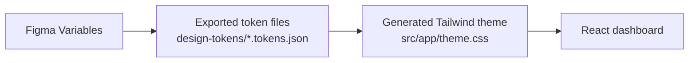
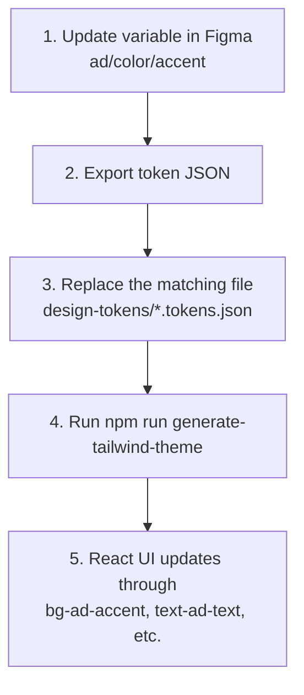

# Design To Dev Workflow

This sample demonstrates a simple design-token handoff:



## The Idea

Designers work in Figma. Developers work in code. The shared contract is the token name:

```txt
ad/color/bg
ad/color/surface
ad/color/text
ad/color/accent
ad/chart/series-1
ad/radius/md
ad/space/4
```

The app does not hard-code values like `#2563EB`. It uses semantic Tailwind utilities generated from those token names:

```tsx
<section className="bg-ad-bg text-ad-text border-ad-border">
  <button className="bg-ad-accent text-ad-surface">Review</button>
</section>
```

## Files

| File | Purpose |
| --- | --- |
| `design-tokens/light.tokens.json` | Light theme export |
| `design-tokens/dark.tokens.json` | Dark theme export |
| `scripts/generate-tailwind-theme.mjs` | Converts token exports into Tailwind CSS |
| `src/app/theme.css` | Generated theme variables consumed by Tailwind |
| `src/app/globals.css` | Tailwind entry point for the Next.js app |

## Change Flow

When a designer changes a token, the path is:



## Appearance

The app supports two appearance files:

```txt
light.tokens.json
dark.tokens.json
```

Those files generate CSS variables that respond to the operating system:

```css
:root {
  /* light token values */
}

@media (prefers-color-scheme: dark) {
  :root {
    /* dark token values */
  }
}
```

No React theme state or in-app switcher is required. Tailwind utilities point at CSS variables, and the browser updates those variables when the OS appearance changes.

## White Labeling

Brand is separate from appearance. A fuller white-label system would use brand and appearance as two axes:

```txt
default.light.tokens.json
default.dark.tokens.json
brand.light.tokens.json
brand.dark.tokens.json
```

This sample keeps one brand and focuses on the design-to-dev handoff plus OS-driven light/dark appearance.

## Build Command

```bash
npm run generate-tailwind-theme
```

This reads:

```txt
design-tokens/light.tokens.json
design-tokens/dark.tokens.json
```

and writes:

```txt
src/app/theme.css
```
